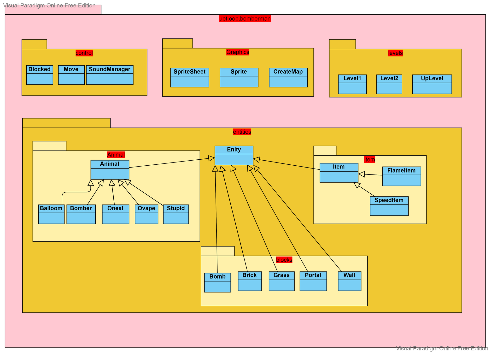

# Bomberman

[Giới thiệu](#giới-thiệu)  
[Cài đặt](#cài-đặt)  
[Mô tả về các đối tượng trong trò chơi](#mô-tả-về-các-đối-tượng-trong-trò-chơi)  
[Mô tả cách chơi](#mô-tả-cách-chơi)  

## Giới thiệu
Project này là bài tập lớn số 2 môn Lập trình hướng đối tượng. Nhiệm vụ của bọn mình là mô phỏng lại trò chơi Bomberman kinh điển của NES.

Nhóm gồm các sinh viên:
- [Nguyễn Việt Hưng](https://www.facebook.com/profile.php?id=100018016965114) - 21020335

- [Đào Quang Huy](https://www.facebook.com/quanghuyls123) - 21020329
## Cài đặt
Để khởi chạy được game cần cài đặt [Java SE Development Kit 8](https://www.oracle.com/java/technologies/downloads/#java8), sau đó:
- Clone project. Tạo project mới bằng IntelIJ bằng cách trỏ tới thư mục chứa project đã clone.
- Sau khi tạo project thành công, trong IntelIJ, click vào thư mục res trong phần quản lí **Project**, chuột phải chọn **Make Directory as**, sau đó chọn **Resources Root** 
- Chạy file **Bomberman.java**.

## Mô tả về các đối tượng trong trò chơi
-  *Bomber* là nhân vật chính của trò chơi. Bomber có thể di chuyển theo 4 hướng trái/phải/lên/xuống theo sự điều khiển của người chơi.

-  *Enemy* là các đối tượng mà Bomber phải tiêu diệt hết để có thể qua Level. Enemy có thể di chuyển ngẫu nhiên hoặc tự đuổi theo Bomber,.... tùy theo loại Enemy. Các loại Enemy sẽ được mô tả cụ thể ở phần dưới.

-  *Bomb* là đối tượng mà Bomber sẽ đặt và kích hoạt tại các ô Grass. Sau khi kích hoạt một thời gian, Bomb sẽ tự nổ, các đối tượng *Flame*  được tạo ra.

-  *Grass* là đối tượng mà Bomber và Enemy có thể di chuyển xuyên qua, và cho phép đặt Bomb lên vị trí của nó

-  *Wall* là đối tượng cố định, không thể phá hủy bằng Bomb cũng như không thể đặt Bomb lên được, Bomber và Enemy không thể di chuyển vào đối tượng này

-  *Brick* là đối tượng được đặt lên các ô Grass, không cho phép đặt Bomb lên nhưng có thể bị phá hủy bởi Bomb được đặt gần đó. Bomber và Enemy thông thường không thể di chuyển vào vị trí Brick khi nó chưa bị phá hủy, ngoại trừ Enemy hịn.

-  *Portal*sẽ hiện ra và nếu tất cả Enemy đã bị tiêu diệt thì người chơi có thể qua Level khác bằng cách di chuyển vào vị trí của Portal.

Các *Item* cũng được giấu phía sau Brick và chỉ hiện ra khi Brick bị phá hủy. Bomber có thể sử dụng Item bằng cách di chuyển vào vị trí của Item. Thông tin về chức năng của các Item được liệt kê như dưới đây:

-  *SpeedItem* Khi sử dụng Item này, Bomber sẽ được tăng vận tốc di chuyển thêm một giá trị thích hợp

-  *FlameItem* Item này giúp tăng phạm vi ảnh hưởng của Bomb khi nổ (độ dài các Flame lớn hơn)

Các loại Enemy:

-  Balloom là Enemy đơn giản nhất, di chuyển ngẫu nhiên với vận tốc cố định

-  Oneal có tốc độ di chuyển thay đổi, lúc nhanh, lúc chậm và có thể đuổi theo Bomber nếu trong vùng tìm kiếm của nó.

-  Stupid là enemy có trí thông minh hạn chế nhất, nó chỉ di chuyển ngang qua lại.

-  Ovape cũng di chuyển tương tự Balloom nhưng có khả năng đi xuyên tường.  

## Mô tả cách chơi
- Người chơi có thể sử dụng 4 phím điều hướng hoặc 4 phím W/A/S/D để điều khiển nhân vật.
- Nhấn phím space để đặt bom.
- Khi một Enemy bị nổ chết, người chơi sẽ nhận được điểm tương ứng với giá trị của Enemy.
- Khi người chơi bị bom nổ, Enemy giết, màn chơi sẽ được reset lại.

